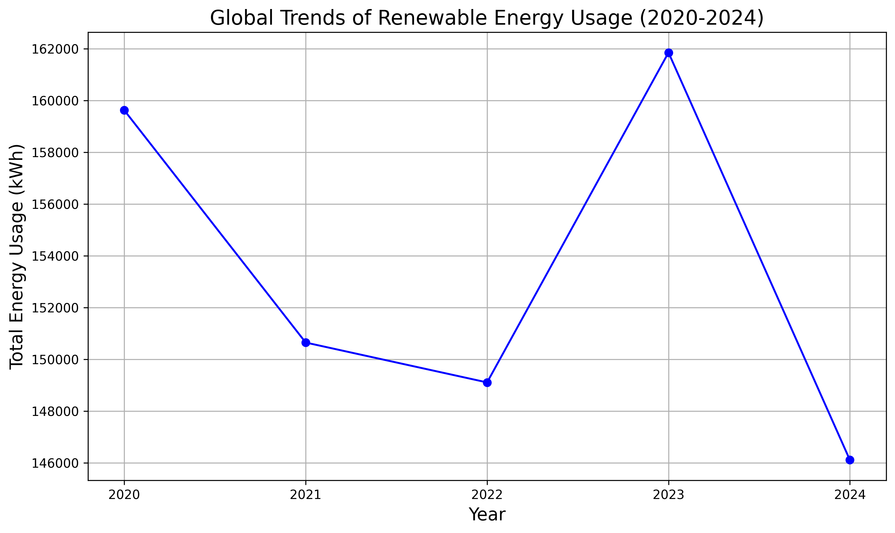
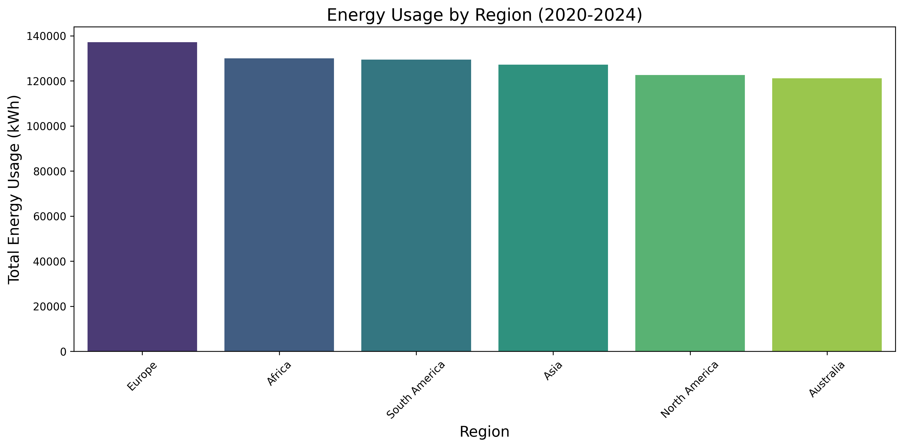
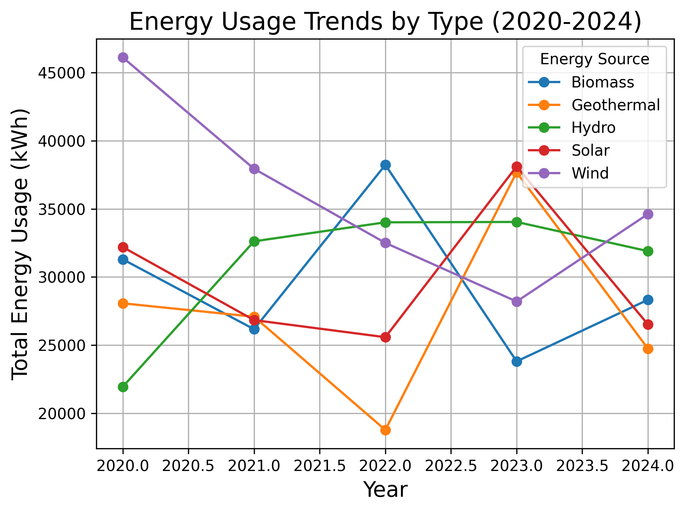
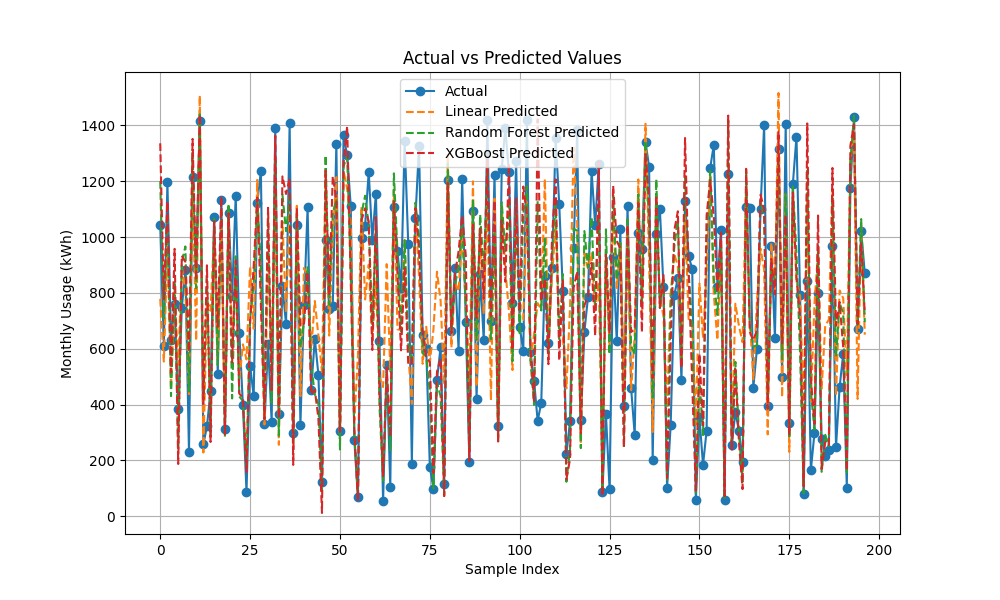

# Global Energy Usage Analysis Report

## Table of Contents

- [Global Energy Usage Analysis Report](#global-energy-usage-analysis-report)
  - [Table of Contents](#table-of-contents)
  - [Overview](#overview)
  - [Trend Analysis](#trend-analysis)
    - [1. Global Energy Usage Trend Line Chart](#1-global-energy-usage-trend-line-chart)
    - [2. Energy Usage by Region Bar Chart](#2-energy-usage-by-region-bar-chart)
    - [3. Energy Type Distribution Trends](#3-energy-type-distribution-trends)
  - [Key Findings](#key-findings)
  - [Predictive Modeling](#predictive-modeling)
    - [Model Comparison](#model-comparison)
  - [Data Source](#data-source)
  - [Methodology](#methodology)

## Overview

This analysis is based on the Global Renewable Energy Usage dataset from Kaggle (2020-2024), examining three key aspects:

1. Annual energy consumption trends
2. Regional energy usage distribution
3. Energy type utilization patterns

## Trend Analysis

### 1. Global Energy Usage Trend Line Chart

Key observations:

- Peak energy consumption recorded in 2023
- Notable upward trend from 2020 onwards
- Significant decline observed in 2024
- Fluctuations correlate with global economic conditions

### 2. Energy Usage by Region Bar Chart

Regional insights:

- Europe leads in renewable energy consumption
- Africa and South America show strong adoption rates
- Relatively balanced distribution across regions
- Australia, despite lower total usage, maintains competitive per capita consumption

### 3. Energy Type Distribution Trends

Energy mix findings:

- Wind and Solar energy usage fluctuated significantly, but remained dominant overall.
- Geothermal energy saw a significant increase in 2023, but usage remained stable in other years.
- Biomass usage peaked in 2022 and then slightly decreased.
- Hydroelectric power usage remained relatively stable.

## Key Findings

1. Temporal Patterns:

   - Overall upward trend in global energy usage
   - Significant year-over-year variations

2. Regional Distribution:

   - Europe maintains leadership in energy consumption
   - Balanced global development in energy usage

3. Energy Type Evolution:
   - Renewable energy sources show increasing dominance in the global energy mix
   - Wind and solar energy emerged as leading renewable sources
   - Traditional energy sources show gradual decline in usage share
   - Diversification of energy sources indicates positive trend towards sustainability

## Predictive Modeling

### Model Comparison

Three machine learning models were implemented to predict future energy usage patterns:

- Linear Regression [R-squared: 0.5842838684930511]
- Random Forest [R-squared: 0.7164419031828511]
- XGBoost [R-squared: 0.6324273918222492]

After comparative analysis, the Random Forest model demonstrated superior performance in predicting energy usage patterns, showing better accuracy and reliability compared to other models.

## Data Source

- Dataset: Global Renewable Energy Usage 2020-2024
- Source: [Kaggle Dataset Link](https://www.kaggle.com/datasets/hajraamir21/global-renewable-energy-usage-2020-2024/data)
- Time Period: 2020-2024

## Methodology

- Data processing and visualization using Python (Pandas, Matplotlib)
