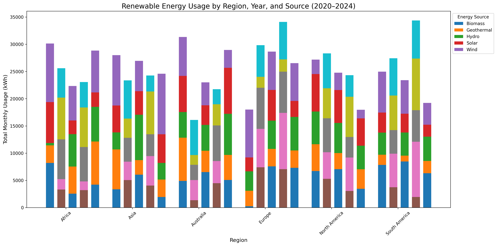
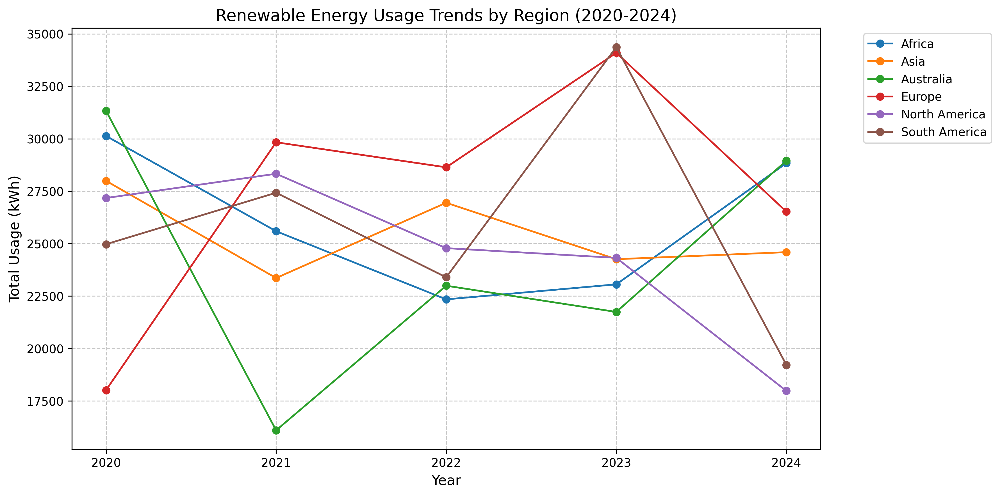
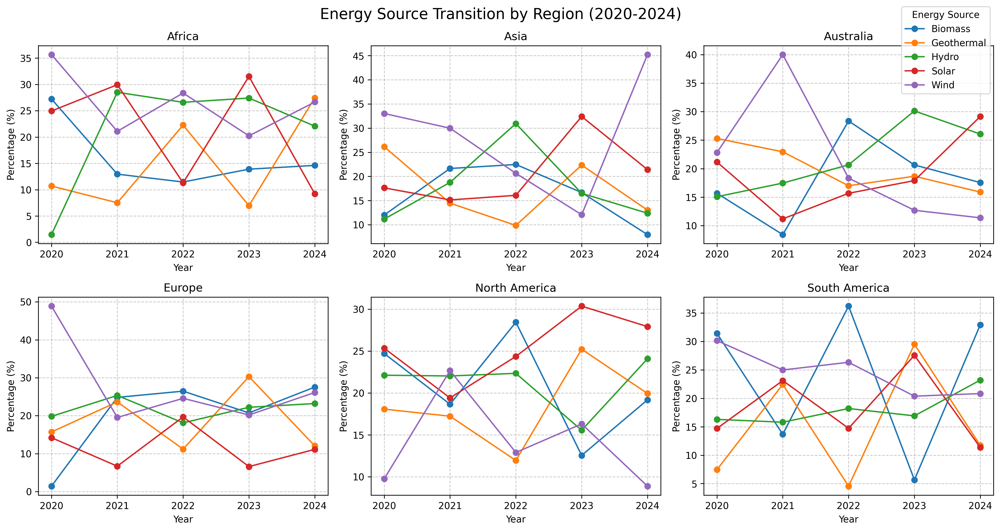

# 全球再生能源採用趨勢分析

## 研究目標

分析不同國家和地區再生能源的採用趨勢，以了解全球再生能源發展現況。

## 主要發現

### 1. 地區能源結構差異

- **北美地區**: 以太陽能和風能為主，能源多樣性指數較高
- **歐洲**: 能源組合最為多元化，風能佔比較高
- **亞洲**: 水力發電佔比較大，但太陽能快速增長
- **澳洲**: 地熱能源使用比例較高，反映其獨特的地理優勢
- **非洲**: 太陽能佔主導地位，能源多樣性指數較低

### 2. 時間趨勢分析 (2020-2024)

- **高成長地區**:
  - 歐洲 (年均增長率 14.61%)
  - 澳洲 (年均增長率 5.48%)
- **負成長地區**:
  - 北美 (年均增長率 -9.05%)
  - 亞洲 (年均增長率 -2.45%)
- **成長波動性**:
  - 最穩定: 亞洲 (標準差: 13.99%)、北美 (標準差: 13.30%)
  - 最不穩定: 澳洲 (標準差: 41.66%)、南美 (標準差: 38.54%)

### 3. 能源多樣性評估

- **高多樣性地區** (Shannon 指數 > 1.60):
  - 澳洲 (1.608)
  - 南美 (1.600)
- **中等多樣性地區** (Shannon 指數 1.58-1.60):
  - 北美 (1.594)
  - 非洲 (1.589)
  - 亞洲 (1.587)
- **低多樣性地區** (Shannon 指數 < 1.58):
  - 歐洲 (1.577)

### 4. 能源結構特徵

- **風能主導地區**:
  - 非洲 (佔比 26.80%)
  - 亞洲 (佔比 28.20%)
  - 歐洲 (佔比 25.87%)
  - 南美 (佔比 24.38%)
- **其他主導能源地區**:
  - 北美: 太陽能 (佔比 25.15%)
  - 澳洲: 水力發電 (佔比 21.78%)

## 關鍵結論

1. **地區差異性**

   - 能源結構選擇與地理條件高度相關
   - 經濟發展水平影響能源多樣性

2. **發展趨勢**

   - 整體呈現穩定上升趨勢
   - 成長率和穩定性存在地區差異

3. **轉型特徵**
   - 發達地區：多元化、穩定性高
   - 發展中地區：快速成長、波動較大

## 視覺化圖表

1. 各地區能源結構 組成
   
2. 2020-2024 年使用量趨勢
   
3. 能源結構轉型分析
   

## 統計數據表

### 1. 地區總用電量及主導能源

| 地區 | 總用電量 (kWh) | 主導能源類型 | 主導能源佔比 |
| ---- | -------------- | ------------ | ------------ |
| 歐洲 | 137,107.45     | 風能         | 25.87%       |
| 非洲 | 129,967.09     | 風能         | 26.80%       |
| 南美 | 129,382.83     | 風能         | 24.38%       |
| 北美 | 122,591.56     | 太陽能       | 25.15%       |
| 澳洲 | 121,122.63     | 水力         | 21.78%       |
| 亞洲 | 127,153.97     | 風能         | 28.20%       |

### 2. 地區成長統計

| 地區 | 平均成長率 | 標準差 | 最高成長 | 最低成長 |
| ---- | ---------- | ------ | -------- | -------- |
| 歐洲 | 14.61%     | 37.96% | 65.60%   | -22.21%  |
| 澳洲 | 5.48%      | 41.66% | 42.82%   | -48.62%  |
| 非洲 | 0.13%      | 18.50% | 25.07%   | -15.07%  |
| 南美 | -0.51%     | 38.54% | 46.92%   | -44.09%  |
| 亞洲 | -2.45%     | 13.99% | 15.36%   | -16.55%  |
| 北美 | -9.05%     | 13.30% | 4.26%    | -26.09%  |

## 技術細節

- 分析工具：Python
- 主要套件：pandas, matplotlib, seaborn, numpy
- 資料期間：2020-2024
- 資料來源：[全球再生能源使用數據集](https://www.kaggle.com/datasets/hajraamir21/global-renewable-energy-usage-2020-2024/data)
